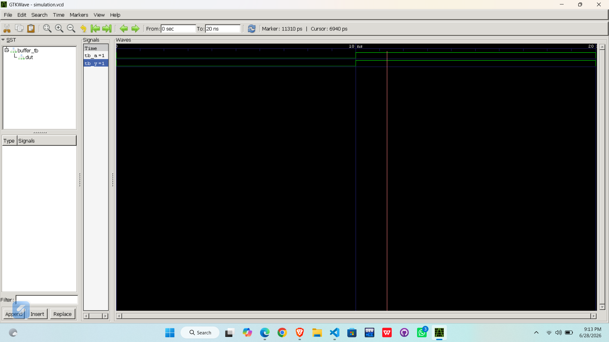

# Lab 1: Introduction to VHDL Programming and Open-Source Simulation Environment

## Objective

- To understand the basic structure of a VHDL program.
- To design and simulate a simple Buffer circuit using VHDL.
- To compile the design using GHDL.
- To verify the output waveform using GTKWave.

---

# Theory

VHDL (Very High Speed Integrated Circuit Hardware Description Language) is a hardware description language used to model and simulate digital circuits. It allows designers to verify the behavior of a digital circuit before implementing it in hardware.

A VHDL program mainly consists of three parts:

### 1. Library
The IEEE library provides standard data types and packages required for digital circuit design.

```vhdl
library IEEE;
use IEEE.STD_LOGIC_1164.ALL;
```

### 2. Entity
The entity defines the interface of the circuit, including its input and output ports.

For this experiment:

- Input : A
- Output : Y

### 3. Architecture
The architecture describes the behavior of the circuit.

```vhdl
Y <= A;
```

This statement means that the output always follows the input.

### Buffer Circuit

A Buffer is the simplest digital logic circuit. It has one input and one output. The output is always equal to the input.

### Truth Table

| Input (A) | Output (Y) |
|-----------|------------|
| 0         | 0          |
| 1         | 1          |

---

# Output (Screenshot/Image)

The VHDL design was successfully compiled and simulated using GHDL. The waveform generated in GTKWave confirms that the output signal follows the input signal.

**Simulation Results:**

| Time (ns) | Input A | Output Y |
|-----------|---------|----------|
| 0–10      | 0       | 0        |
| 10–20     | 1       | 1        |
| 20–30     | 0       | 0        |

# OUTPUT





# Discussion and Conclusion

In this laboratory experiment, a simple Buffer circuit was implemented using VHDL. The design file and testbench were compiled successfully using GHDL, and the simulation waveform was viewed using GTKWave.

The simulation results showed that the output signal always followed the input signal, which verifies the correct operation of the Buffer circuit. This experiment provided an understanding of the basic structure of a VHDL program, including Library, Entity, Architecture, and Testbench. It also introduced the complete VHDL design flow consisting of compilation, elaboration, simulation, and waveform verification.

Hence, the objectives of the experiment were successfully achieved.