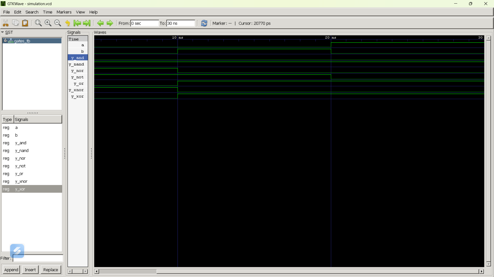

# Lab 2: VHDL Code for Realizing Logic Gates


## Objective

- To write VHDL code for basic logic gates: AND, OR, NOT, NAND, NOR, XOR, and XNOR.
- To simulate each logic gate using GHDL.
- To verify the truth table of each gate using GTKWave.

---

## Tools Used

- Visual Studio Code
- GHDL
- GTKWave
- Git & GitHub

---

## Files Included

| File Name | Description |
|-----------|-------------|
| ANDDesign.vhd | AND gate design |
| ORDesign.vhd | OR gate design |
| NOTDesign.vhd | NOT gate design |
| NANDDesign.vhd | NAND gate design |
| NORDesign.vhd | NOR gate design |
| XORDesign.vhd | XOR gate design |
| XNORDesign.vhd | XNOR gate design |
| testbench.vhd | Testbench for all logic gates |
| simulation.vcd | Simulation waveform |
| output.png | GTKWave waveform screenshot |
| README.md | Lab report |

---

## Procedure

1. Write the VHDL code for all seven logic gates.
2. Create a common testbench for simulation.
3. Compile all VHDL files using GHDL.
4. Elaborate the testbench.
5. Run the simulation and generate the VCD file.
6. Open the waveform using GTKWave.
7. Verify the output with the expected truth table.

---

## GHDL Commands

```bash
ghdl -a ANDDesign.vhd ORDesign.vhd NOTDesign.vhd NANDDesign.vhd NORDesign.vhd XORDesign.vhd XNORDesign.vhd testbench.vhd

ghdl -e GATES_TB

ghdl -r GATES_TB --vcd=simulation.vcd

gtkwave simulation.vcd
```

---

## Expected Truth Table

| A | B | AND | OR | NOT A | NAND | NOR | XOR | XNOR |
|---|---|-----|----|-------|------|-----|-----|-------|
| 0 | 0 | 0 | 0 | 1 | 1 | 1 | 0 | 1 |
| 0 | 1 | 0 | 1 | 1 | 1 | 0 | 1 | 0 |
| 1 | 0 | 0 | 1 | 0 | 1 | 0 | 1 | 0 |
| 1 | 1 | 1 | 1 | 0 | 0 | 0 | 0 | 1 |

---

## Output (Screenshot/Image)



---

# Discussion and Conclusion

In this laboratory experiment, the VHDL implementation of basic logic gates (AND, OR, NOT, NAND, NOR, XOR, and XNOR) was successfully completed using GHDL and GTKWave. The design files and testbench were compiled, elaborated, and simulated without errors.

The simulation results verified that the output of each logic gate matched its expected truth table for all input combinations. The GTKWave waveform confirmed the correct operation of every gate.

This experiment provided practical knowledge of VHDL programming, digital logic design, simulation, and waveform analysis. Hence, the objectives of the experiment were successfully achieved.