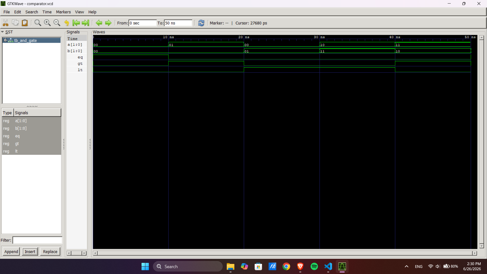

# Computer Architecture Lab 5
## VHDL Code for Combinational Circuits: 2-Bit Magnitude Comparator

---

## Objective

- To design and simulate a 2-bit magnitude comparator using VHDL.
- To understand how comparison operations are implemented in digital hardware.
- To verify the comparator outputs using GHDL and GTKWave.

---

## Theory

A **Magnitude Comparator** is a combinational circuit used to compare two binary numbers. It generates three outputs based on the comparison between the inputs.

For two 2-bit binary numbers **A** and **B**:

- **EQ (Equal)** = HIGH when **A = B**
- **GT (Greater Than)** = HIGH when **A > B**
- **LT (Less Than)** = HIGH when **A < B**

In this lab, the comparator is designed using **VHDL**. The `NUMERIC_STD` library is used to convert the input vectors into unsigned numbers so that arithmetic comparison can be performed easily. The design is verified using a testbench, simulated with **GHDL**, and the waveform is viewed in **GTKWave**.

---

## Files Included

```
Lab5/
│── 2bitComparator.vhd     # Design file
│── comparator_tb.vhd        # Testbench
│── comparator.vcd           # Simulation waveform
│── output.png               # Output screenshot
│── README.md                # Documentation
```

---

## Simulation Commands

### Analyze

```bash
ghdl -a 2bitComparator.vhd comparator_tb.vhd
```

### Elaborate

```bash
ghdl -e tb_and_gate
```

### Run Simulation

```bash
ghdl -r tb_and_gate --vcd=comparator.vcd
```

### View Waveform

```bash
gtkwave comparator.vcd
```

---

## Expected Output

| A | B | EQ | GT | LT |
|:-:|:-:|:-:|:-:|:-:|
|00|00|1|0|0|
|01|00|0|1|0|
|00|01|0|0|1|
|10|11|0|0|1|
|11|10|0|1|0|
|11|11|1|0|0|

---

## Output

### GTKWave Simulation Result



---

## Discussion

The VHDL program for the 2-bit magnitude comparator was successfully implemented and tested. Various input combinations were applied through the testbench to verify the outputs. The waveform generated in GTKWave confirmed that the comparator correctly indicates whether one input is equal to, greater than, or less than the other.

---

## Conclusion

The objective of the experiment was achieved successfully. A 2-bit magnitude comparator was designed using VHDL, simulated using GHDL, and verified with GTKWave. The obtained results matched the expected output, demonstrating the correct operation of the comparator circuit.